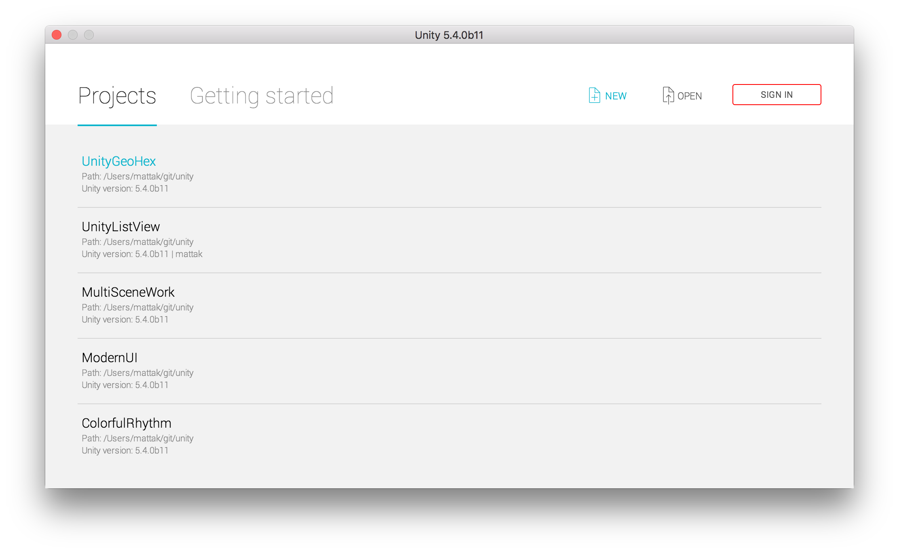
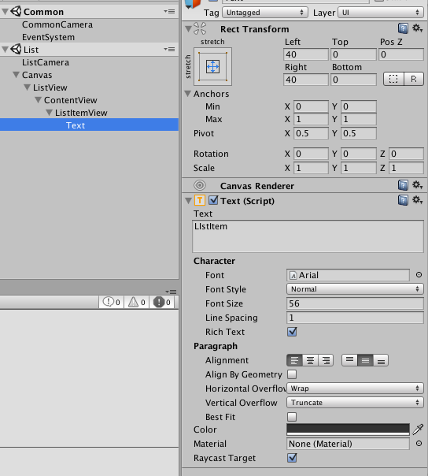
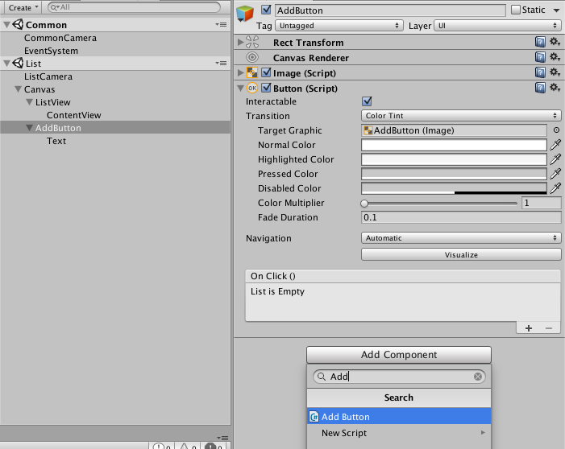

# ListViewの作成

# 作業手順

## 1. プロジェクトの作成

Newを選択

名前を入力する

- 入力 "UnityListView"
- 2Dを選択

## 2. Previewのサイズ設定

1. Gameタブを選択
2. "Free Aspect" をドロップダウン
3. "+" ボタンを選択

縦画面で9:16の画面をつくる

- Label: ""
- Type: "Aspect Ratio"
- Width & Height: 9 16

以後、シーンは9:16を選択して縦画面にする

## 3. Common.unityの作成

Common.unity保存

- File > Save Scene (もしくは cmd + s)
- 名前: "Assets/Scenes/Common.unity"

UI Imageの作成
- GameObject > UI > Image

これでCanvas, Image, EventSystemが生成される

## 4. List.unity作成

Sceneを作成

- File > New Scene

List.unity保存

- Path: "Assets/Scenes/List.unity"

## 5. MultiSceneEditting

Common.unityを開く

- ProjectTreeからCommon.unityを開く

List.unityをHierarchyにDrag & Drop

- 複数のシーンが表示される

## 6. Canvasを移動

Canvasを移動
- Common.unity から List.unity

| Before | After |
|-----------------------------|----------------------------|
|  |  |

## 7. Cameraの名前をリネーム

- Common.unity の"Main Camera" => "CommonCamera"
- List.unity の"Main Camera" => "ListCamera"

Canvasにスクリプトを追加
(クロスシーンのカメラを一意に参照するように変更)

- [CameraFinder.cs](https://gist.github.com/mattak/b49bb8066f285123f963703c9f33a060#file-camerafinder-cs) を Assets/ScriptsにDL
- Add Component: CameraFinder

ついでに"ListCamera"のAudioListenerをDisableにしておく.
(複数のAudioListenerが存在するとログに注意がでる)

## 8. Canvasの設定

Canvasの設定

- Canvasを選択
- Screen Space - Cameraにする
- Render Camera > "ListCamera" にする

CanvasScalerの設定

- UI Scale Mode: "Scale With Screen Size"
- Reference Resolution: x "1080", y "1920"

## 9. ListViewをつくる

Canvas > Imageのリネーム
- "Image" -> "ListView" にリネーム

Canvas > ListView > Imageの作成
- ListViewを右クリック
- UI > Image で子Viewを作成
- リネーム: "Image" -> "ContentView"

ListViewとContentViewを全画面にする

- RectTransformの図形を選択
- Altキーを押すと表示が変わる、その状態で右下の全体にひろげる状態をクリック

同様にContentViewも位置の指定

- Pivot x: 0.5 y: 1
- Altおしながら、Top & Stretchを選択 

ListViewにScroll Rectを追加
- Add Component: "Scroll Rect"
- ContentにContentViewを追加
- Horizontalのチェックを外す

ListViewにマスクを追加

- AddComponent: "Mask"

ContentViewにVertical Layout Groupを追加
- Add Component: Vertical Layout Groupを追加
  - Child Force ExpandのHeightのチェックはずす

ContentViewにContent Size Filterを追加
- Add Component: ContentSizeFilter 追加
- Vertical Fit: "Preferred Size"

## 10. ListItemを作ろう

ContentView > Button
- "Button" => "ItemView"にリネーム
- Layout Elementを追加
    - Min Heightを100に設定

わかりやすく背景色を変更
灰色(`#CACACA`) とかにしておく

Textの状態を変更
- RectTransform: stretch x stretch
    - Left: 40, Right: 40, Top: 0, Bottom: 0
- Text
    - Text: "ListItem"
    - FontSize: 56
    - Alignment: Left

"Assets/Prefabs" フォルダを作成.
HierarchyのListItemViewを選択して、作成したフォルダにDrag&Dropする

Prefabとして実体ができたので、HierarchyのListItemViewは削除

## 11. ListItemViewを追加するボタンを作成

Canvasにボタンを追加

- Canvasを選択
- 右クリック UI > Button
- 名前: "AddButton"

ボタンの位置を下付きにする
- RectTransform: stretch bottom
    - Pivot x:0.5, y:0
    - Height: 200

ボタンのテキストサイズを変更
- FontSize: 56
- Text: "追加"

## 12. ListItemViewを追加するScriptをアタッチ

Assets/Scripts/AddButton.csを作成

- [AddButton.cs](https://github.com/mattak/UnityListView/blob/master/Assets/Scripts/AddButton.cs)を書く、もしくはDL

AddButtonにScriptを追加

- AddButtonを選択
- Add Component: "AddButton"
- Prefab: "ListItemView" (ProjectよりAssets/Prefabs/ListItemViewよりDrag&Drop)
- Add To: "ContentView" (HierarchyよりContentViewをDrag&Drop)

実行して、アイテム追加できればOK

お疲れ様でした。

